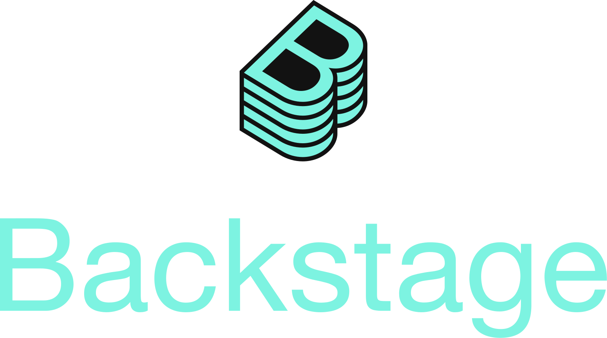
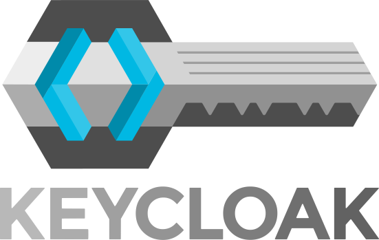
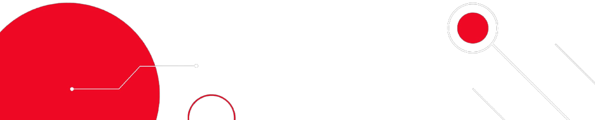

<!-- ================================================================================================ -->
<!--                                        PROFILE HEADER                                          -->
<!-- ================================================================================================ -->

<!-- Banner Image -->

<!-- Profile Views Counter -->

 
   

<!-- Animated Typing Effect -->

<!-- ================================================================================================ -->
<!--                                        ABOUT ME SECTION                                        -->
<!-- ================================================================================================ -->

  
  📚 Enterprise Solutions Architect at [Red Hat](https://www.redhat.com)
  
  🌱 Always learning about tech trends **Kubernetes, Cloud, DevOps, AI, etc.**

  <!-- Future: Add Oracle/Alura participation when active -->
  <!-- 👩‍💻 Participant in the Enastic program of [Oracle Latin America](https://www.oracle.com/lad) and [Alura Latam](https://www.aluracursos.com/) -->

  🌍 Contributor in the [Kubernetes Project](https://github.com/kubernetes/kubernetes)

  📫 How to reach me **hugo.pguima@gmail.com**

 

<!-- ================================================================================================ -->
<!--                                      SOCIAL CONNECTIONS                                        -->
<!-- ================================================================================================ -->

<h3 align="center">Connect with me:</h3>

  <!-- LinkedIn -->
  
  
  <!-- Future social media links (uncomment when needed) -->
  <!-- Discord -->
  <!--  -->
  
  <!-- Twitter -->
  <!--  -->

 

<!-- ================================================================================================ -->
<!--                                    TECHNOLOGY STACK                                           -->
<!-- ================================================================================================ -->

<h3 align="center">Tech Stack & Tools:</h3>

<!-- Primary Technologies Table -->
| **Languages & Libs** | **Containers** | **DevOps Tools** |
|:---:|:---:|:---:|
|    |   |    |
|    |   |    |
|     | |    |

<!-- Infrastructure & Platforms Table -->
| **Infrastructure Tools** | **Cloud Platforms** | **Operating Systems** |
|:---:|:---:|:---:|
|   |    |   |
|   | |   |

 

<!-- ================================================================================================ -->
<!--                                      ARCHIVED CONTENT                                         -->
<!-- ================================================================================================ -->
<!-- 
  LEGACY TECH SECTION - ARCHIVED
  This section has been replaced by the optimized table format above.
  Keeping for reference in case individual icons need to be restored.
  
  Additional technologies that could be added to main tables:
  - Figma, Firebase, Git, HTML5, JavaScript, MongoDB, Node.js, Flutter, Android Studio, VS Code
-->

<!-- ================================================================================================ -->
<!--                                      GITHUB STATISTICS                                        -->
<!-- ================================================================================================ -->

<!-- Achievement Trophies -->
<h3 align="center">GitHub Stats:</h3>

 
   

<!-- Statistics Cards -->

  
  <!-- GitHub Stats Card -->
   
  
  <!-- Most Used Languages Card -->
  

<!-- Contribution Streak -->

  

<!-- ================================================================================================ -->
<!--                                         FOOTER                                                -->
<!-- ================================================================================================ -->

<!-- Footer Banner -->
